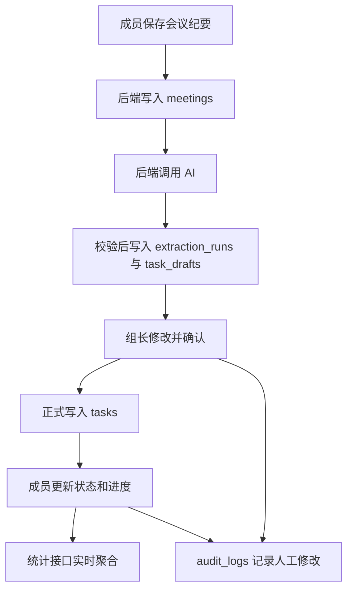

# 成员3一步一步实施指南

你的最终职责不是“写几个接口”，而是保证前端的每一个业务动作都有可信的后端规则、持久化数据和权限保护。下面按实际开发顺序列出完整工作。

## 第1步：确认环境和项目边界

1. 安装 Node.js 22.5 或以上版本。
2. 在项目根目录执行 `npm install`。
3. 复制配置：`cp .env.example .env`。
4. 暂时保持 `LLM_MODE=mock`，先打通业务流程，再配置真实模型。
5. 不要在 React 源码中保存数据库密码或 AI 密钥；浏览器只能调用 `/api/*`。

验收：`node --version` 满足要求，`npm run server` 能输出 API 地址、数据库位置和 AI 模式。

## 第2步：理解系统的数据流



必须能讲清楚：`task_drafts` 是 AI 建议，`tasks` 才是团队正式任务；两者不能混为一张表。

## 第3步：初始化数据库

执行：

```bash
npm run db:setup
```

该命令先运行 `server/migrations/001_initial.sql`，再写入演示数据。主要表如下：

| 类别 | 数据表 | 用途 |
|---|---|---|
| 账号 | `users`、`auth_sessions` | 用户资料、密码哈希和登录会话 |
| 团队 | `teams`、`team_members` | 团队及成员角色 |
| 会议 | `meetings` | 原始纪要和会议日期 |
| AI | `extraction_runs`、`task_drafts` | 每次提取记录和待确认草稿 |
| 任务 | `tasks` | 已由组长确认的正式任务 |
| 审计 | `audit_logs` | 人工修改、确认、状态变更和删除记录 |

验收：数据库中不应出现明文密码；删除会议和任务使用 `deleted_at` 软删除，避免误删答辩数据。

## 第4步：启动并检查认证接口

```bash
npm run server
```

依次检查：

1. `GET /api/health` 不需要登录。
2. `POST /api/auth/login` 使用演示组长账号登录。
3. 从响应中复制 token，使用请求头 `Authorization: Bearer <token>` 调用受保护接口。
4. `GET /api/auth/me` 应返回用户、团队和角色，但绝不能返回密码哈希。
5. `POST /api/auth/logout` 后，同一个 token 应立即失效。

实现要点：密码使用带随机盐的 `scrypt`；数据库只保存 token 的 SHA-256 哈希，即使数据库泄露也不能直接拿 token 登录。

## 第5步：验证三类角色权限

使用三个演示账号分别登录：

- 组长：可以编辑/拒绝/确认 AI 草稿，管理全部任务。
- 组员：可以录入会议、查看团队任务，只能更新自己负责的任务状态和进度。
- 教师/助教：只读查看团队数据、AI 记录和审计日志。

所有权限必须在 `server/app.js` 再判断一次。前端隐藏按钮只改善交互，不构成安全控制。

验收：用组员 token 修改其他人的任务应得到 HTTP 403；用教师 token 新建会议也应得到 HTTP 403。

## 第6步：打通会议纪要接口

前端“保存会议纪要”调用 `POST /api/meetings`，后端校验：

- 标题和纪要不能为空；
- 会议日期必须是真实存在的 `YYYY-MM-DD`；
- 数据必须写入当前用户所在团队；
- 修改和删除时校验记录归属；
- 普通成员只能修改自己录入的会议，组长可管理团队全部会议。

验收：刷新网页后会议仍存在，证明数据不是保存在 `localStorage` 中。

## 第7步：打通 AI 草稿提取

点击“AI提取任务”后只发送 `meetingId`，后端自行读取数据库中的会议内容，不能让前端直接传任意文本冒充已保存会议。

后端处理顺序：

1. 创建状态为 `pending` 的 `extraction_runs`；
2. 读取会议日期、纪要和团队成员名单；
3. 调用本地演示提取器或真实模型接口；
4. 校验负责人、日期、优先级和原文依据；
5. 把结果写入 `task_drafts`；
6. 将运行记录改为 `succeeded`；失败时改为 `failed` 并保存安全的错误描述。

验收：输入“下周三前，小王整理实验数据，小李完成展示PPT，大家周五讨论测试结果”，系统应提取三条草稿；“大家”不能被擅自绑定给某一个人，必须显示待确认。

## 第8步：实现人工确认闭环

组长可以调用：

- `PATCH /api/ai/drafts/:id`：修正任务、负责人、日期、优先级或原文依据；
- `DELETE /api/ai/drafts/:id`：拒绝错误草稿；
- `POST /api/tasks/confirm`：将完整草稿转为正式任务。

确认前后端必须检查：负责人属于当前团队、截止日期明确、原文依据能在会议纪要中逐字定位。确认操作放在数据库事务中，同时完成“创建任务、锁定草稿、写审计日志”；任一步失败时全部回滚。

验收：未指定负责人的草稿不能确认；补充负责人并确认后，任务应出现在团队看板。

## 第9步：实现任务管理和动态逾期

正式任务基础状态只保存：`待开始`、`进行中`、`已完成`、`已取消`。

“已逾期”是展示状态，规则为：

```text
基础状态不是“已完成/已取消” 且 截止日期早于今天 => 展示为“已逾期”
```

这样第二天打开系统时，无需定时任务也能立即看到正确逾期结果。前端不能提交“已逾期”作为状态；后端收到后返回 422。

验收：组员能把自己的任务改为“进行中/已完成”，不能改标题、负责人、优先级，也不能修改别人的任务。

## 第10步：实现统计和审计

`GET /api/statistics` 从正式任务实时计算：总数、已完成、未完成、逾期、完成率、状态分布和成员负载。

`GET /api/audit-logs` 展示谁在何时修改了哪个字段及修改前后值；`GET /api/ai/extractions` 展示每次模型调用的状态、模型、提示词版本和草稿数量。

验收：在看板完成一项任务后刷新统计页，完成数、完成率和图表同步变化。

## 第11步：运行自动化测试

```bash
npm run test:backend
```

测试覆盖：日期解析、健康检查、未登录拦截、密码非明文、三类角色、AI 草稿、人工修正、正式确认、越权字段、动态逾期、审计日志和跨团队隔离。

验收：输出 `tests 15 / pass 15 / fail 0`。如果失败，先阅读首个断言的实际值和期望值，不要通过删除断言来“让测试通过”。

## 第12步：完成前后端联调

1. 启动后端 `npm run server`。
2. 启动前端 `npm run dev`。
3. 按“登录 → 新建会议 → AI 提取 → 修正 → 确认 → 看板 → 更新状态 → 统计”完整操作一次。
4. 再用组员和教师账号各操作一次，确认权限提示与 HTTP 状态一致。
5. 打开浏览器开发者工具，确认 AI 密钥从未出现在请求或前端源码中。

## 第13步：构建和交付

```bash
npm run build
npm run server
```

构建完成后，Node 后端会同时托管 `dist`，访问 `http://localhost:3001` 即可演示。交付时包含源代码、迁移 SQL、`.env.example`、测试、接口文档、权限设计和部署说明，但不要提交真实 `.env`、数据库运行文件或 `node_modules`。

## 你的最终自检清单

- [ ] 能画出数据库表之间的关系
- [ ] 能解释密码和 token 如何保护
- [ ] 能说明为什么 AI 草稿不能直接成为任务
- [ ] 能现场演示组员越权请求被后端拒绝
- [ ] 能说明“已逾期”为何不直接存入数据库
- [ ] 能展示一次 AI 运行记录和一条人工修改日志
- [ ] 能独立启动后端、迁移数据库和运行测试
- [ ] 能完整讲解前端操作对应的 REST API
