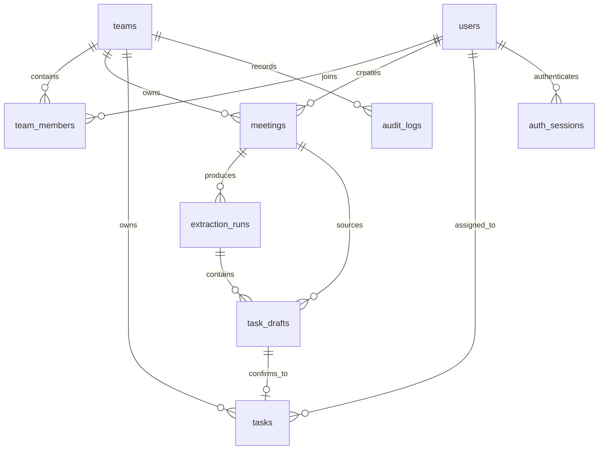

# 数据库设计

数据库采用 SQLite，结构由 `server/migrations/001_initial.sql` 创建。所有时间戳使用 ISO 8601 UTC 字符串，业务日期使用 `YYYY-MM-DD`。

## 实体关系

## 表设计

### `users` 用户表

| 字段 | 类型 | 约束 | 说明 |
|---|---|---|---|
| `id` | INTEGER | PK | 用户ID |
| `name` | TEXT | NOT NULL | 姓名；应用层保证团队内可区分 |
| `email` | TEXT | UNIQUE, NOCASE | 登录邮箱，不区分大小写 |
| `password_hash` | TEXT | NOT NULL | `scrypt$盐$派生值`，不存明文 |
| `system_role` | TEXT | CHECK | `student` 或 `teacher` |
| `created_at` / `updated_at` | TEXT | NOT NULL | 创建、更新时间 |

### `teams` 团队表

| 字段 | 类型 | 约束 | 说明 |
|---|---|---|---|
| `id` | INTEGER | PK | 团队ID |
| `name` | TEXT | UNIQUE | 团队名称 |
| `description` | TEXT | 可空 | 团队描述 |
| `join_code` | TEXT | UNIQUE | 预留邀请码 |
| `created_by` | INTEGER | FK users | 创建者 |
| `created_at` / `updated_at` | TEXT | NOT NULL | 时间戳 |

### `team_members` 团队成员表

| 字段 | 类型 | 约束 | 说明 |
|---|---|---|---|
| `id` | INTEGER | PK | 关系ID |
| `team_id` | INTEGER | FK teams | 所属团队 |
| `user_id` | INTEGER | FK users | 用户 |
| `team_role` | TEXT | CHECK | `leader` 或 `member` |
| `joined_at` | TEXT | NOT NULL | 加入时间 |

`UNIQUE(team_id, user_id)` 防止重复加入同一团队。教师/助教使用 `users.system_role=teacher`，不需要伪装为团队成员。

### `auth_sessions` 会话表

| 字段 | 类型 | 约束 | 说明 |
|---|---|---|---|
| `token_hash` | TEXT | PK | 随机 token 的 SHA-256 哈希 |
| `user_id` | INTEGER | FK users | 会话用户 |
| `expires_at` | TEXT | NOT NULL | 过期时间 |
| `created_at` | TEXT | NOT NULL | 创建时间 |

浏览器持有原始 token，数据库只持有哈希；退出登录会删除对应行。

### `meetings` 会议纪要表

| 字段 | 类型 | 约束 | 说明 |
|---|---|---|---|
| `id` | INTEGER | PK | 会议ID |
| `team_id` | INTEGER | FK teams | 数据归属团队 |
| `title` | TEXT | NOT NULL | 会议标题 |
| `meeting_date` | TEXT | NOT NULL | 解析相对日期的基准 |
| `content` | TEXT | NOT NULL | 原始会议纪要 |
| `created_by` | INTEGER | FK users | 录入者 |
| `deleted_at` | TEXT | 可空 | 软删除标记 |

### `extraction_runs` AI 提取运行表

| 字段 | 类型 | 约束 | 说明 |
|---|---|---|---|
| `meeting_id` | INTEGER | FK meetings | 输入会议 |
| `requested_by` | INTEGER | FK users | 发起人 |
| `provider` / `model_name` | TEXT |  | 模型来源和模型名 |
| `prompt_version` | TEXT | NOT NULL | 提示词版本，便于复盘 |
| `input_text_snapshot` | TEXT | NOT NULL | 调用时纪要快照 |
| `raw_response_json` | TEXT | 可空 | 模型原始响应 |
| `status` | TEXT | CHECK | `pending/succeeded/failed` |
| `error_message` | TEXT | 可空 | 安全的失败说明 |
| `created_at` / `completed_at` | TEXT |  | 开始、完成时间 |

保存快照的原因：会议纪要之后可能被修改，分析 AI 质量时必须知道模型当时实际看到的内容。

### `task_drafts` AI 任务草稿表

| 字段 | 类型 | 说明 |
|---|---|---|
| `extraction_run_id` / `meeting_id` | INTEGER | 对应提取运行和会议 |
| `title` | TEXT | 任务名称 |
| `assignee_text` | TEXT | 模型输出的原始负责人表达 |
| `assignee_id` | INTEGER | 校验后映射的团队成员，可空 |
| `due_date_text` | TEXT | 原始日期表达，如“下周三” |
| `due_date` | TEXT | 解析出的绝对日期，可空 |
| `priority` | TEXT | 高/中/低/未指定 |
| `source_quote` | TEXT | 必须能在会议原文中定位 |
| `needs_confirmation` | INTEGER | 是否存在待人工确认信息 |
| `ambiguity_reason` | TEXT | 不明确原因 |
| `draft_status` | TEXT | 待确认/已确认/已拒绝 |
| `original_payload_json` | TEXT | 单条模型原始结构 |

### `tasks` 正式任务表

| 字段 | 类型 | 说明 |
|---|---|---|
| `team_id` / `meeting_id` | INTEGER | 团队和来源会议 |
| `source_draft_id` | INTEGER UNIQUE | 来源草稿；防止重复确认 |
| `title` / `description` | TEXT | 任务内容 |
| `assignee_id` | INTEGER | 负责人 |
| `due_date` | TEXT | 截止日期 |
| `priority` | TEXT | 高/中/低/未指定 |
| `status` | TEXT | 待开始/进行中/已完成/已取消 |
| `progress_percent` | INTEGER | 0–100 |
| `source_quote` | TEXT | 会议原文依据 |
| `created_by` / `confirmed_by` | INTEGER | 创建者、确认者 |
| `confirmed_at` | TEXT | 确认时间 |
| `deleted_at` | TEXT | 软删除标记 |

注意：表中不保存“已逾期”。API 查询时根据 `due_date < 今天` 且基础状态未完成/未取消动态计算。

### `audit_logs` 审计日志表

| 字段 | 类型 | 说明 |
|---|---|---|
| `team_id` / `user_id` | INTEGER | 数据团队和操作人 |
| `entity_type` / `entity_id` | TEXT / INTEGER | 实体类型和ID |
| `action` | TEXT | created/updated/confirmed/rejected/deleted 等 |
| `field_name` | TEXT | 被修改字段，可空 |
| `old_value` / `new_value` | TEXT | 修改前后值 |
| `created_at` | TEXT | 操作时间 |

## 索引策略

- `meetings(team_id, meeting_date DESC)`：最近会议列表；
- `task_drafts(meeting_id, draft_status)`：查待确认草稿；
- `tasks(team_id, status)`：团队看板；
- `tasks(assignee_id, status)`：个人任务；
- `tasks(team_id, due_date)`：逾期和时间排序；
- `audit_logs(team_id, entity_type, entity_id)`：追踪修改记录；
- `auth_sessions(expires_at)`：清理过期会话。

## 事务边界

以下操作必须在单个事务中完成：

1. 注册用户 + 创建/加入团队 + 写成员关系；
2. AI 成功返回后更新运行记录 + 写全部草稿 + 记录日志；
3. 确认草稿 + 创建正式任务 + 锁定草稿 + 记录日志；
4. 业务数据修改 + 对应审计日志。

这样可以避免“任务创建了但草稿仍显示待确认”等半完成状态。

