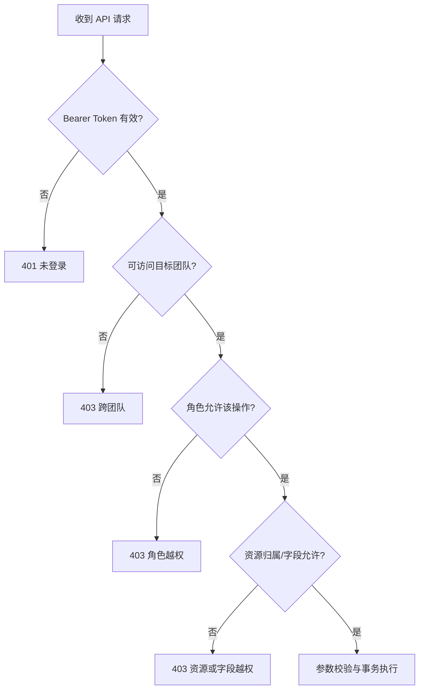

# 权限设计

系统采用 RBAC（角色权限）与资源归属校验结合的方式。角色决定“能做哪类操作”，团队和负责人决定“能操作哪一条数据”。

## 权限矩阵

| 功能 | 组员 | 组长 | 教师/助教 |
|---|:---:|:---:|:---:|
| 注册、登录、退出 | ✓ | ✓ | ✓（预置账号） |
| 查看团队成员 | ✓ | ✓ | ✓ |
| 查看会议纪要 | ✓ | ✓ | ✓ |
| 新增会议纪要 | ✓ | ✓ | — |
| 修改/删除自己录入的会议 | ✓ | ✓ | — |
| 修改/删除他人录入的会议 | — | ✓ | — |
| 发起 AI 提取 | ✓ | ✓ | — |
| 查看 AI 草稿 | ✓ | ✓ | ✓ |
| 编辑、拒绝、确认 AI 草稿 | — | ✓ | — |
| 查看团队任务 | ✓ | ✓ | ✓ |
| 手工新建任务 | — | ✓ | — |
| 修改任务全部字段 | — | ✓ | — |
| 修改自己任务的状态/进度 | ✓ | ✓ | — |
| 修改他人任务 | — | ✓ | — |
| 删除任务 | — | ✓ | — |
| 查看统计 | ✓ | ✓ | ✓ |
| 查看 AI 提取记录和审计日志 | — | ✓ | ✓ |

## 后端校验顺序

校验代码集中在 `server/auth.js` 和 `server/app.js`：

- `authenticate`：验证 token、过期时间并装载用户和团队角色；
- `requireTeamAccess`：阻止学生跨团队读取或修改；
- `requireLeader`：保护草稿确认、全字段任务管理等操作；
- `requireStudentWrite`：保证教师/助教为只读；
- 任务更新处理器：普通组员必须是 `assignee_id` 对应用户，且请求字段只能为 `status` 和 `progressPercent`。

## 为什么不能只依赖前端按钮

用户可以绕过网页，直接使用浏览器控制台、Postman 或脚本调用接口。因此即使页面不显示“删除”按钮，后端仍必须检查角色。自动化测试会直接构造越权 API 请求验证这一点。

## 数据隔离

- 学生的团队 ID 只从服务端会话读取，忽略其 URL 中伪造的 `teamId`；
- 会议、草稿、任务、统计和日志查询都带 `team_id` 条件；
- 教师可使用 `?teamId=<id>` 选择课程团队，但写操作统一拒绝；
- 每次读取单条资源后仍检查其 `team_id`，防止通过猜测 ID 越权。

## 认证安全

- 密码：随机盐 + `crypto.scryptSync`，绝不保存或返回明文；
- 会话：登录时生成 256 位随机 token，数据库只存 SHA-256 哈希；
- 过期：每个会话有 `expires_at`，默认 24 小时；
- 退出：立即删除服务端会话；
- 密钥：LLM API Key 只从后端 `.env` 读取，不进入 React、数据库、响应或日志；
- 错误信息：登录失败统一返回“邮箱或密码错误”，避免枚举注册邮箱。

## HTTP 错误约定

| 情况 | 状态码 | 示例错误码 |
|---|---:|---|
| 未提供/无效/过期 token | 401 | `UNAUTHORIZED`、`TOKEN_EXPIRED` |
| 角色、团队或资源越权 | 403 | `FORBIDDEN`、`READ_ONLY_ROLE` |
| 参数或业务字段不合法 | 422 | `VALIDATION_ERROR`、`DERIVED_STATUS` |
| 资源不存在 | 404 | `TASK_NOT_FOUND` |
| 重复确认或已处理 | 409 | `DRAFT_ALREADY_PROCESSED` |

## 可继续增强的安全项

课程版本已经覆盖核心权限和密钥保护。若部署到公网，还应增加 HTTPS、反向代理限流、登录失败频率限制、HttpOnly Cookie/CSRF 防护、安全响应头、备份加密和管理员管理教师账号的流程。

